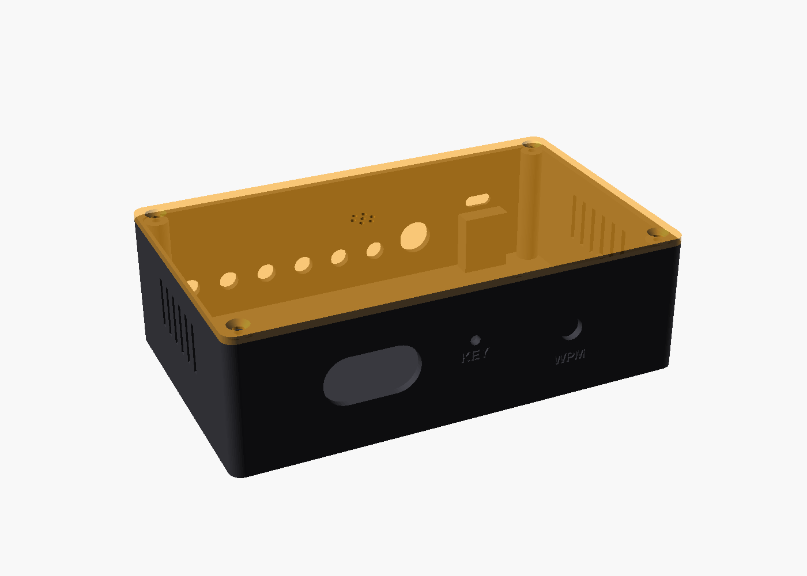
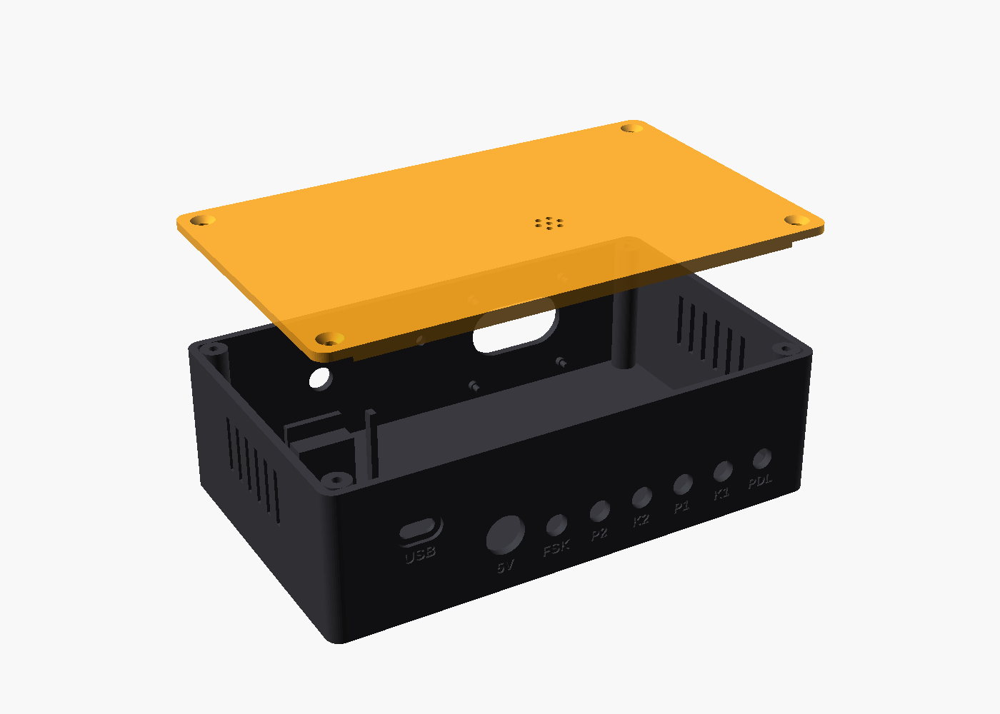

# Enclosure — 3D-printable case

A two-part FDM case for the keyer: **tray** (floor + walls) and **lid**,
both printable without supports. Parametric OpenSCAD source in
[`winkeyer-case.scad`](winkeyer-case.scad); STLs in [`stl/`](stl/).

Outside about **145 × 89 × 45 mm**.




| Panel | What is on it |
|---|---|
| Front | 1.3" OLED window, speed pot (engraved WPM), 3 mm key LED (KEY) |
| Back | 6 × 3.5 mm jacks — PDL, K1, P1, K2, P2, FSK — then 5 V DC jack, USB-C |
| Lid | sound holes over the piezo, which clips into a ring underneath |
| Sides | vent slots near the top |

## Measure before you print

Every part dimension is a named parameter at the top of the `.scad` file,
and the ones marked **MEASURE** vary between vendors. Check these with
calipers — a jack hole 0.5 mm off wastes the print:

| Parameter | Default | Part |
|---|---|---|
| `jack_hole` | 6.3 mm | 3.5 mm panel jack thread (PJ-392 = M6) |
| `dc_hole` | 11.2 mm | DC jack thread (DC-022 = 11 mm, DC-099 = 8 mm) |
| `pot_hole`, `pot_tab_dz` | 7.3, 7.8 mm | 16 mm pot bushing, anti-rotation tab offset |
| `oled_win_w/h`, `oled_win_dz` | 30 × 15.5, +1.5 mm | OLED active area and where it sits on the module |
| `oled_hole_dx/dz` | 30.4 × 28.4 mm | OLED module mounting holes |
| `oled_standoff` | 1.6 mm | OLED glass thickness |
| `kit_l`, `kit_w`, `usb_dz` | 55.3 × 28.3, 1.6 mm | devkit PCB, USB-C centre above the PCB |
| `piezo_d` | 12.4 mm | passive piezo body |

A quick check before the full print: set `part="tray"`, add a
`projection(cut=true)` or just print the back wall alone at 100% as a thin
test strip, and try the jacks and USB plug in it.

## Print

- PETG or PLA, 0.2 mm layers, 3 perimeters, 20% infill.
- **Tray**: open side up. **Lid**: outside face down (the STL is already
  oriented that way).
- No supports. The OLED window's top edge is a 30 mm bridge; the round
  holes in the walls are small enough to print without teardrops.

```bash
cd enclosure
openscad -o stl/tray.stl -D 'part="tray"' --backend Manifold winkeyer-case.scad
openscad -o stl/lid.stl  -D 'part="lid"'  --backend Manifold winkeyer-case.scad
```

## Fit checks — run these after changing any dimension

The `.scad` carries stand-ins for the real parts (devkit with its pin rows
and Dupont leads, OLED glass/PCB/header, pot, jack and DC-jack bodies with
their nuts, piezo). Three modes intersect them, and **each must render
empty** — OpenSCAD prints `Current top level object is empty.`:

```bash
for c in check_tray_lid check_parts_tray check_parts_lid; do
  openscad -o /tmp/$c.stl -D "part=\"$c\"" --backend Manifold winkeyer-case.scad 2>&1 | grep -E "empty|Vertices"
done
```

A `Vertices:` line instead means a collision. `part="ghost"` renders the
tray see-through with the stand-ins in green to find it. The first draft
failed all three: the paddle jack ran into a corner boss, the devkit's
corner into another, and the lid lip into the tray's rounded inside
corners — which is why the box is 140 mm inside rather than 130.

The stand-ins use typical part sizes. They catch layout mistakes; they do
not replace measuring your own parts.

## Hardware

- 4 × M3 × 10 countersunk screws. Default bosses (`boss_hole = 2.6`) take
  self-tapping M3 straight into the plastic; for repeated opening set
  `boss_hole = 4.0` and fit M3 heat-set inserts.
- 4 × 10 mm rubber feet (recesses on the underside).
- A small square of foam tape on the lid's hold-down post.
- 6 × 3.5 mm panel jacks (paddle stereo; KEY/PTT/FSK can be mono), a 3 mm
  LED + 330 Ω, a 5.5/2.1 mm panel DC jack.

## Assembly notes

- **The devkit rests on two shelves under its short ends**, 20 mm off the
  floor so Dupont leads on the header pins fit underneath. The pin rows run
  along the long edges, which are left clear. It is held by its USB-C port
  in the back wall, fences at the antenna end, and the lid's post pressing
  on the WROOM shield through the foam. Lower it in, then slide it back so
  the USB-C shell enters the wall.
- **OLED**: glass against the inside of the front wall, PCB holes over the
  four pins. Melt the pin tips with a soldering iron or add a drop of glue.
- **Key LED**: 3 mm LED + 330 Ω from GPIO2 to GND, in parallel with the
  onboard LED. GPIO2 is a strapping pin, but an LED to GND keeps it low at
  boot, which is the state it needs.
- **DC jack: 5 V only**, into the devkit's 5V/VIN pin. The devkit's
  regulator runs hot well before 12 V, and the schematic notes a
  470–1000 µF capacitor at the board if it browns out on keying.
- The antenna end faces the front. Keep the jacks' metal and wiring from
  bunching over the WROOM antenna.
